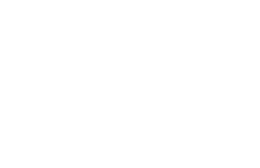

# Blog da Etec Fernando Prestes

Bem-vindo ao **Blog da Etec Fernando Prestes**! Este é um espaço digital para compartilhar as notícias, eventos e atividades que acontecem na nossa escola, localizada em Sorocaba, SP.

## 🚀 Funcionalidades

- **Postagens com Fotos e Vídeos**: Compartilhe momentos importantes com imagens e conteúdos multimídia.
- **Comentários e Curtidas**: Interaja com as postagens após fazer login.
- **Sistema de Busca**: Encontre postagens rapidamente pelo título.
- **Personalização de Perfil**: Adicione foto ao perfil e insira suas redes sociais.
- **Tags (Hashtags)**: Organize postagens usando palavras-chave.

## 📱 Tecnologias Utilizadas

- Frontend: HTML, CSS, JavaScript
- Backend: PHP
- Banco de Dados: MySQL

## 🎯 Objetivo

O blog foi criado para incentivar a comunicação e o engajamento entre a comunidade escolar, permitindo a troca de informações e o registro das atividades realizadas na Etec.

## 📧 Contato

Para dúvidas ou sugestões, entre em contato com a administração do blog via [e-mail](mailto:nexuscommunity07@gmail.com).

---

🌟 **Conectando a Etec Fernando Prestes com a sua comunidade!**
